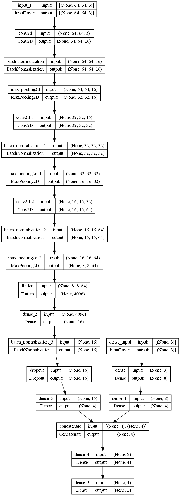

# mlp_cnn_house_price_keras

Trying to combine mlp and cnn, using keras functional api - to improve price predictions. 
It will use numerical data (number of rooms, area,...) along with pictures of house (bedroom, frontal, bathroom, kitchen) to combine results and predict house price. 

Dataset Link: git clone https://github.com/emanhamed/Houses-dataset
 

